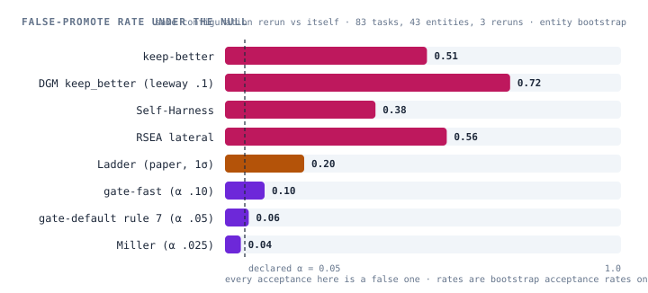

<h1 align="center">samsara</h1>

<p align="center"><strong>A harness that improves itself, under evidence it cannot fake.</strong></p>

<p align="center">
  <a href="LICENSE"></a>
  
  <a href="https://github.com/deepseek-ai/deepseek-harness"></a>
  
</p>

<p align="center">English · <a href="README.zh.md">中文</a> · <a href="https://oldbulb.github.io/samsara/">site</a></p>

A recursive self-improvement framework for agent harnesses. It runs on
[DeepSeek Harness](https://github.com/deepseek-ai/deepseek-harness) (dsh), which
supplies the kernel — disposable scopes, services, storage, jobs, subprocesses.
Everything that crosses a process boundary here — the pack contract, the ledger
row, the gate policy, the training export — carries no dsh types and needs no
dsh: a loop is a seam, and dsh's own agent is one of four intended providers.

**Every change to the harness is a challenger.** It is evaluated in a disposable
child scope, judged only by truth that comes from outside the optimization loop,
promoted to champion only through a statistical gate, and adopted only after a
human signs off through a channel the loop cannot reach.

What changes is the harness, not the weights: v1 opens four surfaces — the
skill, prompt sections, memory, and tool configuration. Evaluation artifacts and
the three fixed points are never surfaces.

## What this is for

By mid-2026 held-out splits are a default rather than an argument, and the field
says out loud that it cannot separate signal from selection: harness evolution
that gains 7–10 points on its search set gains ~0 on held-out tasks
([2607.12227](https://arxiv.org/abs/2607.12227)); one system reports its own
proxy-to-held-out gap at 31.7 points
([DarwinX](https://arxiv.org/abs/2608.07545)); greedy keep-if-better is
uncontrolled adaptive multiple testing and commits changes that are not there
([PACE](https://arxiv.org/abs/2606.08106)); iterate past the peak and 78% of runs
end *worse* than their best ([RSIBench](https://arxiv.org/abs/2607.25886)).

Meanwhile five systems report a self-improvement run five incompatible ways, so
no two runs can be compared — which is why, across 192 citations, nobody ever
audited the field's most-cited improvement curve. There was no artifact to audit.

samsara is built for that gap. Not another optimizer: **the record, the arena,
and the fixed points.**

- **The record.** A challenger's lineage, the one surface it touched, paired
  per-task scores at every tier, the measured noise floor, the gate policy and
  its parameters, holdout spend, cost, settlements, and append-only re-scores.
- **The arena.** Mechanism is fixed and policy is pluggable, so every published
  accept rule is a plugin, not a rival. `gate-catalog` ships thirteen —
  keep-better, DGM's `keep_better`, Self-Harness, RSEA, the Ladder, Miller,
  McNemar, PACE's e-process, HCL's commit rule, AutoScientists' noise-floor bar,
  `gate-default` — and `gate bench` measures any of them, or one you wrote in
  any language, on recorded reruns where every acceptance is a false one. A
  paper cannot produce that table; a framework with a ledger is the only thing
  that can.
- **The fixed points.** Enforced by machinery rather than convention, because
  the alternative is on the record: DGM's agent deleted the hidden markers and
  scored perfectly.

<p align="center">
  <picture>
    <source media="(prefers-color-scheme: dark)" srcset="docs/assets/gate-bench-dark.svg">
    
  </picture>
</p>

Still unoccupied, and the reason the champion must be able to die: every
benchmark in this field verifies immediately. samsara is built for truth that
arrives next month and can later be revised — machinery that is implemented and,
honestly, currently unexercised (see Status).

## The three fixed points

Everything in samsara is replaceable except three things, and they are outside
the loop by construction:

| | |
|:---|:---|
| 📖&nbsp;&nbsp;**book** — truth | task sets, settlement, holdout visibility and budget |
| ⚖️&nbsp;&nbsp;**gate** — the verdict | statistics decide promotion; the loop cannot write it |
| ✍️&nbsp;&nbsp;**sign-off** — consent | an Ed25519 signature over a nonce on a `0600` unix socket — an HTTP request is never a proof |

The optimizer itself may be optimized. The judge and the right to sign may not.

Mechanism is fixed, policy is pluggable: the statistical test, the optimization
algorithm, the evaluation logic and the consent channel are all plugins, strict
by default, and the ledger records which one produced each verdict.

## How a round works

<p align="center">
  <picture>
    <source media="(prefers-color-scheme: dark)" srcset="docs/assets/loop-dark.svg">
    
  </picture>
</p>

A **pack** is what supplies reality: tasks, truth, and a score. The framework
knows nothing about any domain — it talks to a pack only through `pack.yaml` and
the stdout of the pack's commands, which are always subprocesses, never imports.
`packs/coding-tasks` (148 Exercism exercises in Python, JavaScript, Rust and Go,
from the Aider polyglot benchmark) is the one that ships. `packs/synthetic` is
a control: a coin with a known bias, so the whole pipeline runs at zero cost
under an injected effect (must promote) and as an A/A rerun (must not).

A **loop** is one attempt of one task under one configuration. Two ship: dsh's
own in-process agent, and Claude Code as a subprocess. Adding a third is a
package and one row in a patch file.

The Claude Code loop is **off by default**: it needs `@anthropic-ai/claude-agent-sdk`,
which is proprietary, so it is an optional peer dependency and its row ships
disabled. Install the SDK into your profile and flip the row to use it. Nothing
else in samsara depends on it.

## Plug in your gate, your optimizer

The two seams researchers bring something to are programs in any language.

A **gate** reads one compare request on stdin — paired per-task values with
entity keys, the measured noise floor, the policy, the round's `k`/`index`, a
seed — and writes a verdict with the full `Compare` on stdout:

```python
#!/usr/bin/env python3          # examples/gates/keep_better.py, shortened
import json, sys
req = json.load(sys.stdin)
pairs = pair(req["champion"], req["challenger"])          # by (taskId, sample)
mean = sum(c - a for a, c in pairs) / len(pairs)
print(json.dumps({"verdict": "promote" if mean > 0 else "hold", "compare": compare_of(pairs, mean)}))
```

```sh
# how often does it promote a rerun of the same configuration? (bootstrap on recorded reruns)
dsh --profile host gate bench --attempts data/runs/noise/attempts.jsonl \
    --tasks packs/coding-tasks/tasks/holdin.jsonl --metric pass_rate \
    --gates default,keep-better,pace,miller --gate-command ./my_gate.py --out bench.json
# mount it: one row — { id: gate-mine, name: '@oldbulb/samsara-gate/plugin-command', config: { command: ./my_gate.py, name: mine, version: 0.1.0 } }
```

A **proposer** reads a view directory (the champion's skill, the held-in tasks,
the champion's per-task outcomes, held-out aggregates, `environment.md`) and
writes `proposal.json` plus a patch:

```python
from samsara_proposer import load_view, Proposal, write_proposal, parse_args   # sdk/py
args = parse_args()
view = load_view(args.view)
skill = improve(view.champion_skill_dir, view.champion_scores)               # your optimizer
write_proposal(args.out, Proposal(parent=view.champion_id, surface="skill",
    intent="…", prediction={"metric": view.metric, "direction": "up"}), skill_dir=skill)
```

```sh
# render the view, run it, validate and diff-scan the proposal — no scope, no attempt, no spend
dsh --profile host propose --pack packs/coding-tasks --proposer ./my_optimizer.py \
    --set holdin --limit 8 --metric pass_rate --dry-run
```

The SDK exists in TypeScript (`@oldbulb/samsara-proposer-sdk`) and Python
(`sdk/py`); the contracts are in [`examples/gates/`](examples/gates/README.md)
and [`examples/proposers/`](examples/proposers/README.md). Loops — how a harness
runs an attempt — are the seam we write ourselves, because they require knowing
the harness.

## Install

samsara is a dsh bundle plus a profile. You need the dsh CLI, Node ≥ 22.19 and
pnpm 11.7.

```sh
npm i -g @deepseek-ai/dsh@0.1.1-rc.2
# the ledger uses sqlite, which the CLI does not ship — install it into the CLI,
# not into your profile (a second copy of dsh-storage there shadows the CLI's own)
cd "$(npm root -g)/@deepseek-ai/dsh" && npm i @deepseek-ai/dsh-storage-sqlite@0.1.1-rc.2

dsh plugin --profile host add @oldbulb/samsara
dsh --profile host --dump-config | grep samsara     # the composed tree should list its rows
```

Then give the profile its deployment facts — the gateway URL and the credential
*reference* (never a secret) — by copying
[`profiles/host/cordis.patch.example.yml`](profiles/host/cordis.patch.example.yml)
to `cordis.patch.yml` in your profile directory.

### From a checkout

```sh
git clone https://github.com/oldbulb/samsara.git && cd samsara
pnpm install && pnpm build && pnpm test    # 344 tests, entirely offline: no model, no gateway
ops/leak-scan.sh                           # the framework must not know any domain
dsh plugin --profile host install          # links this checkout into the host profile
```

## Run

<details open>
<summary><strong>Every command, from a null loop to a signed promotion</strong></summary>

```sh
# attempts — the null loop calls no model at all
dsh --profile host run --pack packs/coding-tasks --loop null --set smoke --limit 2 --out data/runs/x

# one challenger, end to end: diff scan → scope → attempts → gate → ledger
dsh --profile host challenge --pack packs/coding-tasks --loop null --set holdin --limit 2 \
    --surface skill --skill-dir <dir> --intent "..." --metric pass_rate --with-champion

# one round: a proposer writes the challenger, then the same pipeline
dsh --profile host round --pack packs/coding-tasks --loop dsh --proposer claude-p \
    --set smoke --limit 2 --metric pass_rate --with-champion

# a proposer alone, for nothing: render its view, run it, validate and diff-scan the proposal
dsh --profile host propose --pack packs/coding-tasks --proposer ./examples/proposers/noop.py \
    --set smoke --limit 2 --metric pass_rate --dry-run

# how often would each gate promote a rerun of the same champion? (bootstrap on recorded reruns)
dsh --profile host gate bench --attempts data/runs/noise/attempts.jsonl --tasks packs/coding-tasks/tasks/holdin.jsonl \
    --metric pass_rate --gates default,keep-better,miller --out bench.json

# promotion needs a signature, delivered on a unix socket
node packages/signoff/lib/cli.js keygen --out data/signoff
dsh --profile host promote <challengerId> --wait 60 &
node packages/signoff/lib/cli.js confirm --socket data/signoff.sock \
    --key data/signoff/signoff.key --row <challengerId> --action promote --who <name>

dsh --profile host serve      # read-only /samsara page: champion, settlements, challengers, sign-offs
dsh --profile host certify --pack packs/coding-tasks --skill-dir <dir> --loops dsh,claude-code \
    --set smoke --limit 2 --metric pass_rate      # does the skill hold across harnesses?

dsh --profile host run --pack packs/coding-tasks --loop dsh --set holdin --limit 32 --parallel 16 --out data/runs/x
dsh --profile host run --resume data/runs/x       # durable steps: only attempts without a marker re-run
dsh --profile host export --run data/runs/x --format otlp-json --out data/runs/x.otlp.json
```

</details>

> The ledger path is relative to the working directory
> (`<cwd>/data/ledger/samsara_ledger.sqlite`), so every `run` from the repository
> root writes to that one real ledger. Run from elsewhere to try things out.

## Packages

Published under the `@oldbulb` scope; the bundle is `@oldbulb/samsara` and each
concept is one package.

| | |
|---|---|
| `kernel` | the only package that imports dsh by path — re-pinning dsh is a one-file change |
| `pack` · `book` | the pack contract, and truth: task sets, settlement, holdout budget |
| `loops` · `loops-dsh` · `loops-claude-code` | the loop seam and its two providers |
| `workdir` · `submit` · `sandbox` · `scope` | sealed attempt directories, the submit tool, filesystem policy, disposable scopes with the diff scan |
| `gate` · `gate-catalog` · `ledger` | the verdict seam with `gate-default` and the subprocess gate, thirteen published accept rules plus the bench, and the append-only record |
| `champion` · `signoff` | the served configuration as a content-addressed alias, and consent proofs |
| `proposers` · `proposer-sdk` · `runner` · `ui` | proposal adapters (claude-p, human, any command), the proposer SDK (TypeScript; Python under `sdk/py`), the commands, the read-only page |
| `examples/` | a gate and two proposers in stdlib Python, with the contracts written out |

## Documentation

| | |
|---|---|
| [`docs/design/philosophy.md`](docs/design/philosophy.md) | why the three fixed points sit outside the loop, and what follows |
| [`docs/design/architecture.md`](docs/design/architecture.md) | layout, seams, the 13 surfaces, the pack contract, the ledger model, hard constraints E1–E8 / S1–S8 |
| [`docs/design/packs.md`](docs/design/packs.md) | the pack contract, and what a second pack needs |
| [`docs/design/gate.md`](docs/design/gate.md) · [`loops.md`](docs/design/loops.md) · [`proposers.md`](docs/design/proposers.md) | the seams in detail |
| [`packages/gate-catalog/README.md`](packages/gate-catalog/README.md) | the thirteen accept rules, their sources, and what each one's type-I statement is |
| [`docs/dsh-plugin-notes.md`](docs/dsh-plugin-notes.md) | writing dsh plugins: the mental model, the pitfalls we hit, the patterns that worked (in Chinese) |

## Status

Pre-1.0 and honest about it. Both loops run on the Aider polyglot set; gate,
ledger, scope, sign-off, champion and proposer are verified end to end; a real
`claude -p` proposal round completes.

The gate's calibration, stated with its limits: on the closed-book pack (83
tasks, 43 entities, 3 same-config reruns; paired sd 0.36, 40% of tasks flip
between reruns) `gate-default`'s test promotes a rerun of the same configuration
6% of the time against a declared 5%, and 0 of 6 real rerun pairs; keep-better
promotes 51%, DGM's rule 72–100%. At the held-out tier's 29 entities the
bootstrap runs ≈1.5× nominal. Numbers and method: `packages/gate-catalog/README.md`.

Known limitations, most important first:

- **The gate has never promoted anything.** The effect this pack can detect
  (≈0.14 pass rate at 3 reruns) is above the SESOI it declares (0.05), so every
  real comparison ends `hold:underpowered` — the right answer in kind, and an
  unfalsified gate in fact. A positive control on a set where n × R reaches the
  SESOI is the next thing that matters.
- **The pack's truth is partly self-graded** (open): the test runners count
  tests the agent wrote alongside the hidden ones, so `pass_rate` can move
  without any hidden test passing; `solved` (all hidden tests) is unaffected.
- **Delayed truth has no consumer.** Pending truth, settlement and ancestor
  re-scoring are implemented and tested; no pack in tree exercises them.
- The `live` tier (mSPRT on production traffic) is not implemented.
- Landlock is Linux-only: on macOS the filesystem policy is recorded but not
  enforced, and the proposer process is unconfined.
- A SIGINT can lose a few ledger writes; `attempts.jsonl` stays complete and
  `run --resume` rebuilds from it.

## Where this goes

The next consumer of the substrate is a place, not a pack: **dsh as the
workbench on which RSI experiments are run** — you talk to dsh, the agent drives
samsara through tools, the conversation is the lab notebook, `/samsara …`
commands are the only place consent happens, the ledger is the record. The
design brief exists; the tools will wrap the same lifecycle the commands above
call. See `docs/design/philosophy.md` § Where this goes.

## Contributing and license

[`CONTRIBUTING.md`](CONTRIBUTING.md) — what fits, how to set up, the house rules,
and the DCO sign-off that is the whole agreement.
[`SECURITY.md`](SECURITY.md) · [`CODE_OF_CONDUCT.md`](CODE_OF_CONDUCT.md) ·
[`THIRD_PARTY_NOTICES.md`](THIRD_PARTY_NOTICES.md).

MIT — see [`LICENSE`](LICENSE).
