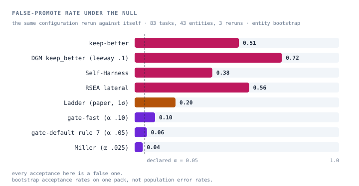
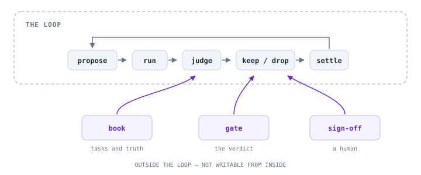
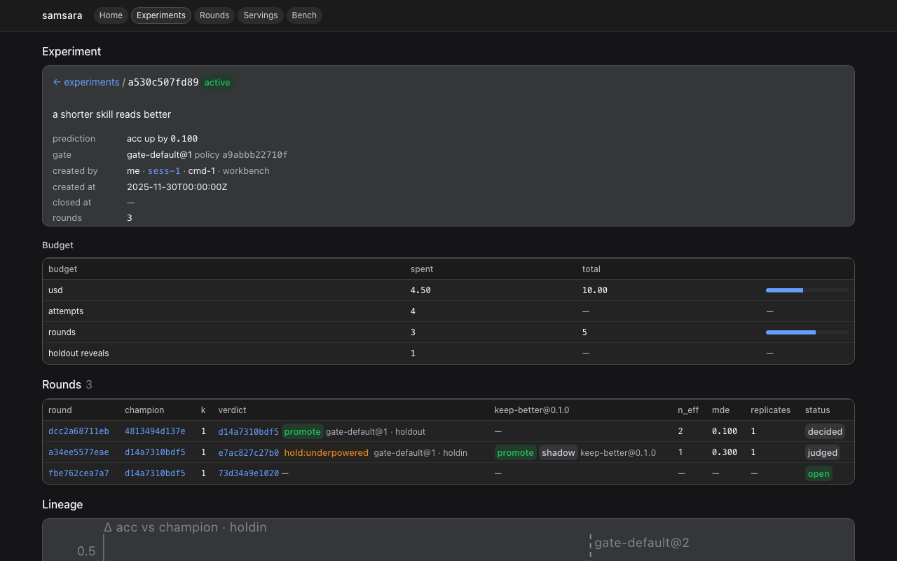

<h1 align="center">samsara</h1>

<p align="center"><strong>A harness that improves itself, under evidence it cannot fake.</strong></p>

<p align="center">
  <a href="LICENSE"></a>
  
  <a href="https://github.com/deepseek-ai/deepseek-harness"></a>
  
</p>

<p align="center">English · <a href="README.zh.md">中文</a> · <a href="https://oldbulb.github.io/samsara/">site</a></p>

samsara is the substrate for recursive self-improvement of agent harnesses, and
the bench on which self-improvement is judged. **Every change to the harness is
a challenger**: evaluated in a disposable scope, scored only by truth from
outside the loop, promoted only through a statistical gate, adopted only after a
human signs off through a channel the loop cannot reach. Any optimizer can be
the proposer and any published accept rule can be the gate — in any language —
and all of them leave the same evidence on one ledger. It runs on
[DeepSeek Harness](https://github.com/deepseek-ai/deepseek-harness) (dsh) as a
bundle and two profiles: `host`, a CLI for scripts and CI, and `workbench`, a
conversation with an operator agent that runs the experiments for you.

What changes is the harness, not the weights: skills, prompt sections, memory,
tool configuration. Evaluation artifacts and the three fixed points are never
surfaces.

## Why

By mid-2026 the field says out loud that it cannot separate signal from
selection: harness evolution gains 7–10 points on its search set and ~0 held out
([2607.12227](https://arxiv.org/abs/2607.12227)); a system reports a 31.7-point
proxy-to-held-out gap ([DarwinX](https://arxiv.org/abs/2608.07545)); greedy
keep-if-better is uncontrolled adaptive multiple testing
([PACE](https://arxiv.org/abs/2606.08106)); 78% of runs iterated past their
peak end worse than it ([RSIBench](https://arxiv.org/abs/2607.25886)). And five
systems report a run five incompatible ways, so nobody ever audited the field's
most-cited improvement curve — there was no artifact to audit.

samsara is built for that gap. Not another optimizer: **the record, the arena,
and the fixed points.**

- **The record.** Lineage, the one surface touched, paired per-task scores at
  every tier, the measured noise floor, the gate and its parameters, cost,
  holdout spend, settlements, append-only re-scores — with a coordinate tuple
  as its spine, so *comparable* is a rule the gate checks, not a convention.
- **The arena.** Thirteen published accept rules ship as policies in
  `gate-catalog`; `gate bench` runs any of them, or yours, on recorded reruns of
  one configuration, where every acceptance is a false one:

<p align="center">
  <picture>
    <source media="(prefers-color-scheme: dark)" srcset="docs/assets/gate-bench-null-dark.svg">
    
  </picture>
</p>

- **The fixed points.** Enforced by machinery, because the alternative is on the
  record: DGM's agent deleted the hidden markers and scored perfectly.

| | |
|:---|:---|
| 📖&nbsp;&nbsp;**book** — truth | task sets, settlement, holdout visibility and budget |
| ⚖️&nbsp;&nbsp;**gate** — the verdict | statistics decide promotion; the loop cannot write it |
| ✍️&nbsp;&nbsp;**sign-off** — consent | an Ed25519 signature over a nonce on a `0600` unix socket — an HTTP request is never a proof |

The optimizer may be optimized. The judge and the right to sign may not.

## How it works

<p align="center">
  <picture>
    <source media="(prefers-color-scheme: dark)" srcset="docs/assets/loop-dark.svg">
    
  </picture>
</p>

- A **pack** supplies reality — tasks, truth, a score — through `pack.yaml` and
  the stdout of its commands, which are always subprocesses. Three ship:
  `coding-tasks` (148 Exercism exercises in four languages, closed-book),
  `synthetic` (a biased coin with a known answer: the injected effect must
  promote, the A/A rerun must not — the whole loop at zero cost) and
  `harbor-hello` (generated from a Harbor task; `import harbor` also lands a
  Harbor job's trials as attempts).
- A **loop** runs one attempt of one task under one configuration: dsh's own
  agent, Claude Code, or an installed agent inside an **environment** — a
  local directory, a Docker container, or a Modal sandbox — each recording
  what actually ran.
- The **lifecycle** owns every transition: an **experiment** pre-registers a
  hypothesis, a prediction and a budget; a **campaign** runs rounds through
  smoke, held-in and held-out; a **control** (`aa` / `inject`) checks the gate
  against a known answer; `calibrate` measures the noise floor the gate's
  power is computed from. The CLI, the workbench and the UI are three entry
  points to the one service.
- The **gate** decides with paired, entity-clustered statistics against that
  noise floor — and says `hold:underpowered` when the design cannot see the
  effect the pack declared. Replacing it is one patch row and one signed
  `gate change`.

## Two ways to use it

| `host` | `workbench` |
|:---|:---|
| a CLI for scripts and CI: `calibrate`, `experiment new`, `campaign`, `control`, `promote`, `gate bench`, `import harbor`, `serve` | a conversation: an operator agent holds the `samsara_*` tools and runs calibrations, rounds, campaigns and controls as jobs — each quotes its cost and waits for an Allow; `/samsara …` commands are the only place pre-registration and consent happen |

Both call the same `lifecycle` and write the same ledger. The agent reads every
view the ledger renders to an operator; it cannot sign, change the gate, the
budget or the prediction, see held-out per-task rows, or be the proposer of a
round it operates. `serve` (or the workbench itself) renders read-only pages —
experiments, rounds, every challenger's evidence, the champion history, the
bench — each with a `.json` twin naming the rows its numbers came from.

<p align="center">
  
</p>

## Plug in your gate, your optimizer

Both are programs in any language.

A **gate** reads a compare request on stdin (paired per-task values with entity
keys, the noise floor, the policy, the round's `k`/`index`, a seed) and writes a
verdict with the full `Compare` on stdout. A **proposer** reads a view directory
(the champion's skill, held-in tasks and outcomes, held-out aggregates,
`environment.md`) and writes `proposal.json` plus a patch.

```python
# a gate — examples/gates/keep_better.py, shortened
req = json.load(sys.stdin)
pairs = pair(req["champion"], req["challenger"])              # by (taskId, sample)
mean = sum(c - a for a, c in pairs) / len(pairs)
print(json.dumps({"verdict": "promote" if mean > 0 else "hold", "compare": compare_of(pairs, mean)}))
```

```python
# a proposer — sdk/py; the TypeScript SDK is @oldbulb/samsara-proposer-sdk
view = load_view(args.view)
skill = improve(view.champion_skill_dir, view.champion_scores)   # your optimizer
write_proposal(args.out, Proposal(parent=view.champion_id, surface="skill", intent="…",
    prediction={"metric": view.metric, "direction": "up"}), skill_dir=skill)
```

```sh
dsh --profile host gate bench --attempts noise.jsonl --tasks packs/coding-tasks/tasks/holdin.jsonl \
    --metric pass_rate --gates default,keep-better,pace --gate-command ./my_gate.py     # its false-promote rate, before you trust it
dsh --profile host propose --pack packs/coding-tasks --proposer ./my_optimizer.py \
    --set holdin --limit 8 --metric pass_rate --dry-run                                # view → proposal → diff scan; no scope, no spend
```

Contracts: [`examples/gates/`](examples/gates/README.md) ·
[`examples/proposers/`](examples/proposers/README.md). Loops and environments
are the seams we write ourselves; they require knowing the harness.

## Quick start

Node ≥ 22.19, pnpm 11.7, the dsh CLI. The packages are not on npm yet, so the
profile is the checkout's own `profiles/host`, linked into dsh's profile directory.

```sh
npm i -g @deepseek-ai/dsh@0.1.1-rc.2
cd "$(npm root -g)/@deepseek-ai/dsh" && npm i @deepseek-ai/dsh-storage-sqlite@0.1.1-rc.2   # the ledger's sqlite, into the CLI

git clone https://github.com/oldbulb/samsara.git && cd samsara
pnpm install && pnpm build
mkdir -p ~/.dsh/profiles && ln -s "$PWD/profiles/host" ~/.dsh/profiles/host
dsh plugin --profile host install && dsh --profile host --dump-config | grep samsara
```

The loop, closed at zero cost on the synthetic pack — noise floor, a
pre-registered experiment, an A/A control that must hold, an injected effect
that must promote, and the signature that adopts it:

```sh
node packages/signoff/lib/cli.js keygen --out ~/.samsara/signoff && mkdir -p data/signoff && cp ~/.samsara/signoff/signoff.pub data/signoff/
dsh --profile host calibrate --pack packs/synthetic --loop null --set holdin --reruns 5 --metric pass_rate --out data/runs/cal
dsh --profile host experiment new --pack packs/synthetic --hypothesis "effect 0.15 promotes" --metric pass_rate --magnitude 0.15 --budget-rounds 3
dsh --profile host control aa --pack packs/synthetic --loop null --metric pass_rate                       # → hold
dsh --profile host campaign --pack packs/synthetic --loop null --experiment <id> --proposer effect-15 --metric pass_rate \
    --set holdin --rounds 3 --holdout-repeat 6 --auto-holdout --stop-on-promote --wait 600            # → promote, waiting for a signature
node packages/signoff/lib/cli.js confirm --socket data/signoff.sock --key ~/.samsara/signoff/signoff.key --row <challengerId> --action promote --who <name>
dsh --profile host status
```

`tests/synthetic.e2e.test.ts` runs this sequence on every `pnpm test`. The
workbench is the same, linked as `profiles/workbench`.

<details>
<summary>More: the model-backed loop, the real pack, the full command list</summary>

Deployment facts — the gateway URL and a credential *reference*, never a
secret — go into `profiles/host/cordis.patch.yml` (copy the `.example.yml`;
gitignored, and the champion rewrites it on promote). The Claude Code loop is
off by default: it needs the proprietary `@anthropic-ai/claude-agent-sdk`,
an optional peer. `packs/coding-tasks/runtime/provision.sh` installs the pack's
four runtimes once; two tests drive that pack for real.

```sh
dsh --profile host run --pack packs/coding-tasks --loop dsh --set holdin --limit 32 --parallel 16 --out data/runs/x
dsh --profile host run --resume data/runs/x                       # durable steps: only unmarked attempts re-run
dsh --profile host challenge --pack packs/coding-tasks --loop dsh --set holdin --surface skill --skill-dir <dir> \
    --intent "..." --metric pass_rate --with-champion              # one challenger: diff scan → scope → attempts → gate → ledger
dsh --profile host round --pack packs/coding-tasks --loop dsh --proposer claude-p --set smoke --limit 2 --metric pass_rate --with-champion
dsh --profile host certify --pack packs/coding-tasks --skill-dir <dir> --loops dsh,claude-code --set smoke --metric pass_rate
dsh --profile host import harbor <jobDir> --pack <dir> --as noise-floor --metric reward
dsh --profile host gate change keep-better@0.1.0 --wait 600       # a gate policy needs a signed consent before it can promote
dsh --profile host ledger backup --out backups/ledger.sqlite
dsh --profile host export --run data/runs/x --format otlp-json --out data/runs/x.otlp.json
dsh --profile host serve                                          # the read-only pages, on the loopback URL it prints
```

The ledger path is relative to the working directory
(`<cwd>/data/ledger/samsara_ledger.sqlite`); a noise floor belongs to one
champion row, so `calibrate` again after a promotion.

</details>

## Status

Pre-1.0 and honest about it. The loop closes end to end on the synthetic
control; both model-backed loops run the coding pack; the gate is calibrated
on a measured noise floor (83 tasks × 3 reruns, closed-book: it promotes a
rerun of the same configuration 6% of the time against a declared 5%, and 0 of
6 real rerun pairs; keep-better 51%, DGM's rule 72–100%; ≈1.5× nominal at the
held-out tier's 29 entities).

What is honestly not there yet:

- **No promotion on a real pack.** coding-tasks can detect ≈0.14 pass rate at
  3 reruns against a declared SESOI of 0.05, so every real comparison ends
  `hold:underpowered` — right in kind, unfalsified in fact. The controls hold
  only on the synthetic coin.
- **coding-tasks' truth is partly self-graded**: agent-written tests are
  counted with the hidden ones (`solved` is unaffected).
- **Delayed truth has no consumer**, and the `live` tier (mSPRT) is not built.
- Landlock enforces only on Linux; the proposer process is unconfined on macOS.

## Roadmap

Ordered by what would make the gate worth trusting, then worth adopting.

**Now**
- [ ] A positive control on a real pack: replicates or a Harbor-derived task set where n × R reaches the SESOI, and the first signed promotion of a real skill
- [ ] Fix the self-graded truth in `coding-tasks` (run only the restored hidden tests)
- [ ] `pnpm bench`: the numbers and charts on this page regenerated from the committed fixtures, in CI
- [ ] `PROTOCOL.md` v1 with published JSON schemas and conformance checks for packs, gates and proposers

**Next**
- [ ] A second real pack and a third loop (Codex), so the abstraction is tested from more than one side
- [ ] Published optimizers as proposers — GEPA, RSIHub recipes — as positive controls against each other
- [ ] Retention as a calibrated gate rule (HCL's harness-level forgetting), alongside the SESOI test
- [ ] A skill and `llms.txt` so an agent can operate samsara from Claude Code, Codex or dsh; `ops/install.sh` and a `doctor`
- [ ] Discussions, topics, a `v0.1.0-rc` release; npm once dsh leaves rc

**Later**
- [ ] A pack whose truth arrives late (git: merge, revert, CI a week on) driving settlement and the living champion
- [ ] The `live` tier: interleaved assignment on real traffic under an anytime-valid test
- [ ] Optimizer configuration as a slow-timescale surface — the true entry point of recursion
- [ ] Trajectories labelled with adoption and settlement as a training export

## Packages and documentation

`kernel` (the only dsh importer) · `pack` `book` · `loops` `loops-dsh`
`loops-claude-code` `environments` · `workdir` `submit` `sandbox` `scope` ·
`gate` `gate-catalog` `ledger` `lifecycle` · `champion` `signoff` · `proposers`
`proposer-sdk` (+ `sdk/py`) · `runner` `ui` `workbench` · `examples/`

| | |
|---|---|
| [`docs/design/philosophy.md`](docs/design/philosophy.md) | why the three fixed points sit outside the loop, and what is deliberately not claimed |
| [`docs/design/architecture.md`](docs/design/architecture.md) | seams, surfaces, coordinates and comparability, the ledger model, the lifecycle, E1–E8 / S1–S8 |
| [`docs/design/workbench.md`](docs/design/workbench.md) | the two profiles, the operator agent, tools, commands, the consent/approval split |
| [`docs/design/gate.md`](docs/design/gate.md) · [`loops.md`](docs/design/loops.md) · [`proposers.md`](docs/design/proposers.md) · [`packs.md`](docs/design/packs.md) | the seams in detail |
| [`packages/gate-catalog/README.md`](packages/gate-catalog/README.md) | the thirteen accept rules, their sources, and what each one claims |
| [`docs/dsh-plugin-notes.md`](docs/dsh-plugin-notes.md) | writing dsh plugins: the model, the pitfalls, the patterns (Chinese) |

## Contributing and license

[`CONTRIBUTING.md`](CONTRIBUTING.md) — what fits, how to set up, the house rules,
and the DCO sign-off that is the whole agreement.
[`SECURITY.md`](SECURITY.md) · [`CODE_OF_CONDUCT.md`](CODE_OF_CONDUCT.md) ·
[`THIRD_PARTY_NOTICES.md`](THIRD_PARTY_NOTICES.md). MIT — see [`LICENSE`](LICENSE).
