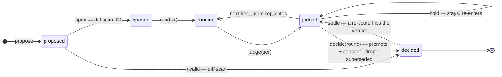

# samsara — architecture

dsh snapshot assumed: `b150a551` (0.1.1-rc.2). Every claim about dsh capability below was read off that source tree unless marked UNVERIFIED; the working notes are in `docs/dsh-plugin-notes.md`.

## Repository layout

```
samsara/
├── CLAUDE.md  README.md  README.zh.md  LICENSE
├── package.json  pnpm-workspace.yaml       # cordis + dsh peers pinned to one commit; no npm publish until dsh leaves rc
├── profiles/
│   ├── host/       package.json  cordis.patch.yml   # what `dsh --profile host` boots: dsh-base + samsara, the CLI; cordis.patch.yml == champion's kept rows
│   └── workbench/  package.json  cordis.patch.yml   # dsh-web-app + samsara + samsara-workbench: the conversation; same ledger, no CLI startup row
├── packages/                                # the framework — TS dsh plugins, one concept each
│   ├── kernel/          dsh API shim (types + the few functions we call); re-pin here
│   ├── book/            createBook    tasks × time × truth; splits; settlement events; visibility (a factory, no service)
│   ├── pack/            ctx.pack      loads pack.yaml; runs pack commands as subprocesses; validates stdout
│   ├── ledger/          ctx.ledger    immutable rows, lineage, comparisons, consents; @Remote RPC; redacting reads
│   ├── scope/           ctx.scopes    open a challenger as an in-memory child scope; patch apply; harness_sha + env_sha
│   ├── champion/        ctx.champion  the served config; promote / demote; profile writer; replay check
│   ├── gate/            ctx.gate      pure statistics + verdict(tier, policy); rejects judge-kind scores by type
│   ├── signoff/         ctx.signoff   consent channel unreachable from sandboxes (unix socket / signed nonce)
│   ├── loops/           ctx.loops     seam: AttemptSpec / LoopRun / HarnessFacts + registry
│   ├── loops-dsh/  loops-claude-code/  (later: loops-codex/  loops-pi/); loops/installed — the agent runs inside the environment (planned: loops-harbor/)
│   ├── workdir/         ctx.workdir   sealed per-attempt workspace: task token, skill snapshot, TMPDIR, pre-tool guard
│   ├── environments/    ctx.environments  registry: where an attempt runs; providers local, docker, modal (planned: harbor)
│   ├── submit/                        submit_<name> tool → <cwd>/<name>.json; host validates
│   ├── proposers/                     adapters that turn an external optimizer (claude -p, codex exec, gepa, human) into proposals
│   ├── ui/                            /samsara SPA route + sidebar/overlay seats
│   └── workbench/                     operator preset + samsara_* tools + /samsara commands + notebook + startup reconciliation
├── packs/
│   ├── coding-tasks/    immediate-truth pack over Aider Polyglot exercises; CI runs it; doubles as the demo
│   └── synthetic/       deterministic pack with a planted effect: the A/A and injected-signal recipes, the e2e fixture
├── examples/            gates/ (external gate policies over stdin/stdout) and proposers/ (external proposer CLIs)
├── ops/                 deployment notes: install, storage layering, restart, archive
├── tests/               framework tests run against packs/coding-tasks and dsh-llm-replay fixtures
├── docs/design/         philosophy, architecture, packs, gate, loops, adoptions
└── data/ (gitignored)   $SAMSARA_HOME default: ledger sqlite + attempt artifacts, one dir per profile
```

Two profiles, because the samsara CLI's one-shot startup row and `dsh-web-app`'s startup row cannot share a profile (B4): `host` is dsh-base + samsara and keeps the CLI for CI, scripts and cron; `workbench` is dsh-web-app + samsara + samsara-workbench, and its bundle patch disables `samsara-run-startup`, `samsara-runner` and samsara's own `webserver` row. Both mount the same `lifecycle`/`ledger`/`gate`/`champion`/`signoff` rows and write the same ledger, so a campaign started in one is resumable from the other. See `docs/design/workbench.md`.

## Plugins and services

| Plugin | Provides | Injects | Notes |
|---|---|---|---|
| `kernel` | typed re-exports of `composeEntries`, `loadProfile`, `renderConfigDump`, loader/include/isolate types | — | the only file that imports dsh internals by path |
| `book` | `createBook(options) → Book`: `tasks(set)`, `tasksetSha(set)`, `assertDisjointHoldout()`, `settle(records, asOf, kind?)`, `pendingTasks()`, `settlements()`, `visibility(taskId, viewer)`, `holdoutBudget()`, `debitHoldout(reason)`; emits `book/settled` | — (a pure factory: the runner and `lifecycle` build one per pack from its task sets and `holdout` policy) | truth latency declared by the pack; disjoint-entity holdout enforced here; the held-out budget is counted here and debited only by `lifecycle`; owns no ledger row — `eval_config_sha` is derived on the challenger row (§ Ledger deviations) and `noise_floors` are ledger rows written by `lifecycle.calibrate` |
| `pack` | `load(dir) → PackDefinition`; `run(cmd, args, stdin) → stdout` via `ctx.subprocess` with own effect | `subprocess` | stdout validated against the command contract; pack never loaded in-process |
| `ledger` | rows/verbs/views: `propose(proposal)`, `setStatus(id, status, patch)`, `recordAttempt(row)`, `appendScores(rows)`, `recordCompare(row)`, `recordConsent(row)`, `recordSettlement(row)`, `openRound(input)`, `updateRound(id, patch)`, `recordNoiseFloor(input)`, `recordServing(row)`, `createExperiment(input)`, `updateExperiment(id, patch)`; reads `challenger(id)`, `attemptsOf(id)`, `scoresOf(id)`, `comparesOf(id)`, `consentsOf(id)`, `round(id)`, `roundsOf(id)`, `noiseFloorFor(evalConfigSha, championId, loop, metric)`, `servings()`, `experiment(id)`, `experiments()`, `lineage(id)`; `read(view, viewer)` redacts held-out for the proposer | `storageDomain` | one ledger, never mirrored; bulk artifacts as files + sha; validates every row against `spec.ts` and derives `eval_config_sha` in `propose`; `challengers.status`, `compares`, `rounds`, `noise_floors`, `servings` and `experiments` are written only through `lifecycle`; the Compare→row mapping is `compareRowOf` in `champion`, called only by `lifecycle.judge` |
| `scope` | `open(challenger) → {ctx, fiber}`; `dispose`; `harnessSha()`, `envSha()` | `kernel`, `loops`, `workdir` | **must** create via `ctx.loader.create(..., null)` into the in-memory root tree (E1); `!!js` forbidden in rows (E3) |
| `champion` | `current()`, `promote(row, consentId)`, `demote(consentId)`, `replayCheck()` | `ledger`, `signoff`, `kernel` | writes `profiles/host/cordis.patch.yml`; verifies hot-apply by re-hashing `--dump-config` (E7); every change appends a `servings` row |
| `lifecycle` | `preregister(experiment)`, `openRound(input)`, `closeRound(id)`; `propose(proposal, {roundId})`, `open(id)`, `run(id, tier, opts)`, `judge(id, tier)`, `decide(roundId)`, `demote(championId, reason, consentId)`, `settle(event)`; `abortRound(id)`, `setExperimentBudget(id, budget, by)`; `calibrate(input)`, `campaign(input, hooks)`, `control(input, hooks)`, `status()`, `nextActions(id)`; owns the challenger status machine, the `rounds` row and the `experiments` row | `ledger`, `scopes`, `gate`, `loops`, `champion`; `executor` (the runner's `runSet`) | the only writer of `challengers.status`, `rounds` and `compares`; asserts the invariants of § Lifecycle at every transition; CLI commands (`run`, `challenge`, `round`, `certify`, `resume`) are consumers of this service and hold no state of their own |
| `gate` | seam: `compare(a, b, tier, opts)`, `verdict(compare, policy)`; `gate-default` implements it | — | policy is a plugin; `gate_method@version` is a ledger coordinate. Default (`gate-default@0.2.0`, rules in `gate.md`): comparability of the coordinate tuples, judge-kind scores rejected by type, validity floor on smoke, power floor (n_eff, and the design MDE from the measured noise floor at α=.05/80% against the pack's SESOI), futility-only early stop on holdin, cost ratio (S8), then one pre-registered one-sided BCa cluster-bootstrap test on the paired held-out Δ at the Holm-adjusted α with mean ≥ SESOI; holdout exposure to the proposer = Ladder signal only (S7). Not implemented: group-sequential tests on fixed-n tiers, an anytime-valid (mSPRT) test on live (live returns `hold`), holdout rotation, a retention rule |
| `signoff` | `request(rowId) → pending`, `confirm(proof)`; proof = nonce signed by a key in a 0600 file / unix socket | — | HTTP endpoints are not proofs (E2) |
| `loops` | `register(provider) → disposer`; `start(AttemptSpec) → LoopRun{events, result, cancel}` | — | provider set == enabled plugins |
| `loops-dsh` | in-process child agent with `meta.cwd`, restricted tools, submit tool attached | `loops`, `agents`, `tools` | |
| `loops-claude-code` | Claude SDK `query` under dsh's subprocess projection; per-attempt base_url for cost | `loops`, `subprocess` | credentials injected explicitly (E5); the LLM proxy is external (gateway), reached only via base_url |
| `workdir` | `materialize({attemptId, claims, skill, mode}) → {path, dispose}`; `.task/token.json` 0400; `.agents/skills/<name>/` snapshot; per-attempt `TMPDIR` (E6); `tools/pre-execute` deny patterns | `tools` | |
| `environments` | `register(provider) → disposer`; `open(EnvironmentSpec) → Environment{id, provider, workdir, exec(argv, opts), put(local, remote), get(remote, local), snapshot?(), facts(), dispose()}`; `EnvironmentSpec = {attemptId, image? {ref | dockerfileDir}, resources {cpus?, memoryMb?, timeoutS}, network none|allowlist|public (+ allowedHosts), env, mounts[]}` | `subprocess` | provider set == enabled plugins: `local` — today's behaviour behind the interface (a directory, `ctx.subprocess` under the landlock policy), the default; `docker` — native, through the `docker` CLI (build from `dockerfileDir` or pull `ref`, `docker exec`, `docker cp`); `modal` — native, through the `modal` TypeScript SDK (pinned, `experimental*` APIs not used): a sandbox per environment, the environment's `env` as a secret, `blockNetwork` / `outboundDomainAllowlist` for the policy, the registry digest as `image.digest` when the ref pins one (else the Modal image id), `snapshotFilesystem()` for `snapshot`; **planned** `harbor` — a Python shim (`sdk/py`, pinned to a Harbor version like dsh is pinned) instantiating Harbor's provider class and serving `start/exec/upload/download/stop` over JSON-RPC on stdio, which brings daytona, langsmith, blaxel, novita, tensorlake; Harbor is never imported in process. `facts()` (provider@version, image digest, resources, network) joins the attempt's `facts_sha`; the provider declares its own concurrency (`--parallel` stays the attempt-level cap; `PACK_STAGE_CAP` applies only to host-side pack commands) |
| `submit` | `submit_<name>` tool; optional one-shot `steer()` on turn-stopping | `tools` | schema is a hint; the host validates with the pack's contract |
| `proposers` | `claude-p`, `codex-exec`, `human-ui`, `gepa` adapters → `Proposal` | `ledger` | external in v1; an in-host optimizer is itself a challenger surface later |
| `ui` | `/samsara` route: champion · last settlement · challengers by tier · pending sign-offs; lineage drill-down | `remote` | |
| `workbench-tools` | `samsara_*` tools for the operator agent: read-only `status`, `packs`, `ledger_view` (viewer `operator`), `compare`, `next_actions`, `bench_gates`, `propose_dry_run`; spending `calibrate`, `campaign_start`, `control`, `round` as jobs owned by the agent, `campaign_stop` | `lifecycle`, `ledger`, `jobs`, `approval` | mounted inside the `samsara-operator` preset, not globally; every spending tool checks the experiment budget, then `ctx.approval.request` with the quoted cost; no tool opens a sign-off |
| `workbench-commands` | `/samsara status · predict · approve · demote · gate · reveal · budget · stop` on `ctx.commands` | `commands`, `lifecycle`, `ledger`, `signoff`, `champion` | the person's channel: consent goes through `ctx.signoff` (the key stays outside the host), the prediction is typed, not paraphrased; results never enter model history |
| `workbench-notebook` | `ctx.on('session/event')` → `notebook` ledger rows for `samsara_*` tool calls/results (a failed result carries `error`), the spend approvals asked and decided (`approval/asked`, `approval/decided`) and `samsara` commands, with the operator's `(provider, model)`; `workbench-tools` adds one `job/done` row per settled job | `ledger` | append-only; never rendered to the proposer |
| `workbench-presets` | installs the shipped `samsara-operator` preset into dsh's user preset root, guarded by a `.samsara-preset-sha` marker | — | never overwrites a directory without the marker |
| `workbench-startup` | on apply: logs one warning per round `open` with a `running` sibling, writes nothing (a round carries no owner, so a round another host drives is indistinguishable); `/samsara reconcile <round-id>` closes one through `lifecycle.abortRound`: running siblings judged `invalid` rule `aborted:restart`, round closed `aborted` (nothing here writes the ledger) | `lifecycle`, `ledger` | jobs do not survive a restart; resume is `run --resume` from the `host` profile |

Dependency direction, made a load-time fact by `inject`: `ui → lifecycle → champion → ledger → {book, gate, signoff, scope} → loops → {workdir, submit, pack}` (book is the `createBook` factory, no service: the runner and `lifecycle` build one per pack); `environments` sits beside `workdir` once the seam lands (`workdir` puts the materialized files into it, `loops` runs installed loops through it, the scope's effect disposes it). The gate and signoff inject nothing from the loop. Nothing below `lifecycle` can change a challenger's status; nothing below `ledger` can write a verdict; nothing below `champion` can write the profile.

## Surfaces

A surface is one mutable layer of the harness. A challenger touches exactly one (v1). Each surface declares a machine-checkable boundary — file globs, config keys, or marked regions — and the diff scan rejects out-of-boundary patches before any evaluation spend.

The design makes a surface a value, not a string, declared by whoever owns its carrier:

```ts
interface Surface {
  name: string                                   // 'skill' | 'prompt' | 'memory' | 'tools' | 'runtime' | 'route' | 'context' | 'hooks' | 'subagent' | 'optimizer'
  owner: 'pack' | 'loop' | 'framework'           // who declares it (below)
  boundary: { globs?: string[]; configKeys?: string[]; markedRegions?: string[] }   // what the diff scan enforces
  carrier: string                                // how a patch is physically applied (loops-dsh: patch key / scoped registration / file under a key)
  envelope: 'config' | 'system' | 'tools' | null // which envelope field its effect lands in; null = behaviour surface
  policy?: string                                // a gate preset that overrides the pack's for this surface (principle 6); absent = the pack's
}
```

The ownership split this type describes — the **pack** declares `skill` and nothing else, a **loop provider** declares the surfaces it can carry with the boundaries of its own carriers, the **framework** declares `optimizer` (the proposer's configuration) — is design, not built: `LoopProvider` carries no `surfaces` field and no `Surface` value exists in code.

What is implemented: boundaries come from the pack's `surfaces:` block in `pack.yaml` (`globs` / `config_keys` per surface name; `surfaceBoundaries` in `packages/pack`), only a surface the pack declares is proposable — the diff scan refuses any other with `SURFACE_UNDECLARED` — and `lifecycle.open` accepts only `skill` (E4: v1 scopes carry no runtime). `Proposal.surface` must name one of the pack's declared surfaces.

Surfaces divide by where their effect shows up, and the division is dsh's own request contract, not ours. dsh logs the envelope of every model request as a `request/header` event — an `EpochHeader` of `config` (provider, model, reasoning, sampling), `system` (the rendered system prompt) and `tools` (the assembled tool schemas) — and holds the invariant that whatever is model-visible is reconstructable from the session log. So:

- **model-visible surfaces** — route → `config`; prompt, skill, memory → `system`; tools → `tools` — leave their whole effect in the envelope. A challenger on one of them differs from the champion in exactly one envelope field, which the loop reports at run time (`loops.md` § Envelope) so the gate can second-check the static diff scan (recorded today; the check is not yet wired); and the token cost of the patch is measurable from the envelope alone, with no model call.
- **behaviour surfaces** — runtime, context, subagent, hooks — never appear in the envelope. They change the shape of the trajectory (turn / step / compaction events) and are measurable only by running.

The envelope is dsh making explicit something every LLM harness has, since every API request carries a model config, a system prompt and a tool list; the *definition* of the surfaces therefore holds for any loop. Only the **carrier** column — how a patch on the surface is physically applied — belongs to loops-dsh; another loop has its own carriers and reports its envelope with the fidelity it can honestly claim. Carriers were read off the dsh source at the pinned commit.

| # | Surface | Contains | dsh carrier | Envelope | Status | Evidence / prior art |
|---|---|---|---|---|---|---|
| 1 | `skill` | Agent Skills spec subset: SKILL.md body + `scripts/ references/ assets/`; **whole directory hashed**; harness-private frontmatter (model/effort/hooks/allowed-tools) stripped and recorded under route / tool surfaces | files under a scope-private `skill-filesystem` provider (`customSkillDirs` + `includeDefaultRoots: false`); the catalog `tool-skill` renders is a prompt section | `system` | v1 challenger | SkillsBench +16.6pp mean but 16/84 tasks negative; SkillOpt, MetaSkill-Evolve, MUSE, SkillsVote, skill-creator |
| 2 | `prompt` | system-prompt / harness-definition text segments (bootstrap, execution, verification, failure-recovery) | the one config-authored fragment `system-prompt.persona`; otherwise scoped prompt sections registered in the agent's setup window, shadowing their global twins | `system` | v1 challenger | Self-Harness: text-only edits, 9/9 held-out non-regressing; AHE: prompt alone −2.3pp — must be attributed separately from skill |
| 3 | `memory` | memory files (CLAUDE.md layers, long-term memory) | `<workdir>/AGENTS.md` (+ `.local.md`) as chosen by `agent-instructions.instructionFileCandidates`, rendered under its `maxBytes` | `system` | v1 challenger | AHE component ablation: memory +5.6pp, largest single item |
| 4 | `tools` | tool-interface configuration: allowlist, descriptions, edit/search/viewer parameters, lint guardrails, diff adapter — not tool implementation code | `ctx.tools.restrict` per scope (dsh has no allowlist key); parameter keys on the tool rows (`tool-fs.read*`, `tool-fs-search.*`, `tool-str-replace-editor.description` — the only exposed description) | `tools` | v1 challenger, **requires the cost-aware gate** | SWE-agent ablations 2–8pp per item; adapter minimal vs full 19.1 vs 73.4; tool changes often move cost ±15–25% at flat pass rate |
| 5 | `runtime` | runtime control: per-task timeout, step / message / tool-error caps, stop policy, permission mode | `sandbox-policy.mode`, `approval.policy`, `bash-sandbox.timeoutMs`; dsh's loop has no step, wall-clock or tool-error cap — those are `AttemptSpec.limits`, enforced by the loop | — | coordinate in v1; challenger once timeout/step are pinned coordinates and the gate is cost-aware | AHE: xhigh 53.9 vs high 63.6 via timeout coupling; HAL: 21/36 no gain from more effort |
| 6 | `route` | model id, reasoning effort, fallback / escalation, pinned model pool (`model_pool_sha`) | `agent-default-model.{provider,model}`, the `llm-*` catalogs; `model_pool_sha` hashes the resolved catalog, not the row | `config` | coordinate in v1 (model upgrade triggers re-scoring); v1.5 challenger at solve-rate@cost | Ares, CodeRescue, RouteLLM train routers offline, outside any loop; routing plateau |
| 7 | `context` | compaction thresholds / stages, observation truncation, tool-result clearing, sub-agent summary length | `compaction-basic.*`, `tool-result-pruner.*`, `spill-policy.maxInlineBytes`, per-tool output caps; one engine, one threshold, no per-stage key | — (route capacity is the separate `request/context` event) | v1 only for keys dsh exposes; rest later | SWE-agent last-5 +3pp; HarnessBridge −47% tokens; no per-stage compaction ablation exists |
| 8 | `hooks` | middleware / hooks: pre-completion checklists, loop detection, context injection | no hooks row is mounted in any shipped bundle (`hooks-claude-code` / `hooks-codex` are unmounted and boot-only); `repeat-tool-reminder` is the one mounted middleware key | — | later (code; needs marked-region boundaries; must never touch evaluation or logging) | AHE middleware +2.2pp |
| 9 | `subagent` | delegation policy, isolated context, return summaries | `tool-subagent.{maxDepth,agentOptions,toolFilter,persona}`; a child agent has its own session and its own envelope | — | later (no isolated delta in evidence) | — |
| 10 | `optimizer` | proposer strategy, sample sizes, reflector model, length caps, budget, meta-skill text, recursion cadence | samsara's own rows (`samsara-proposer-*` config), not a dsh key | — | coordinate in v1 (`optimizer_config_sha`); later a slow-timescale challenger scored by realized child gain in a window, higher n_eff floor, multiple seeds | MetaSkill-Evolve (one level), DGM-H (high variance), Decagon (500 samples overfit) |
| — | ephemeral tools | scripts synthesized inside an attempt | `tool/call` events in the session log | — | **not a surface**: trajectory fact in the export; a proposer may promote one into a persistent `skill` challenger | Live-SWE-agent: no gate, not persisted |
| — | evaluation artifacts | task-set version (+changelog), scorer version, judge model version, truth snapshot, reporting / aggregation rule version | never a row in a challenger's tree; pack side, behind `ctx.subprocess` | — | **not a surface**: immutable coordinates; a version change is a settlement event that re-scores ancestors; changed only at a settlement boundary with sign-off | BIRD 52.8% mislabelled, corrected ranks ρ=0.32; reporting rule alone moves 20.9pp |
| — | fixed points | book, gate, sign-off | services on the host root tree, never under a challenger fiber; truth and consent cross a process boundary (pack stdout, unix socket) | — | never; isolated by machinery (own process, read-only mounts, `env_sha`, diff scan) | DGM App. H objective hacking |

## Pack contract

```yaml
# packs/<name>/pack.yaml
name: coding-tasks
truth_latency: immediate | delayed
skill: { dir: skill/, name: fix-tests }          # SKILL.md body only; no harness syntax
contract: contract.schema.json                   # what submit_<name>.json must satisfy
tasks:
  sets: { smoke: tasks/smoke.jsonl, holdin: tasks/holdin.jsonl, holdout: tasks/holdout.jsonl }
  entity_key: repo | customer_id                 # holdout must be disjoint on this key
  version: 3                                     # bump requires a changelog entry; bump is a settlement event
  protocol:                                      # how tasks are presented; part of the eval_config (EnvHarness vocabulary; the verifier is unchanged)
    stage: closed-book                           # the initial state the agent starts from
    contracts: [hidden-tests]                    # rewrites of what the agent may see or do
metrics:
  primary: { name: pass_rate, unit: fraction, direction: up }   # what the gate decides on; the SESOI below is in this unit
  cost: cost_usd                                 # every pack emits a cost metric (kind: mechanical) per task
runtime:                                         # optional; what the commands and the attempts execute from — the framework assumes no layout
  dirs: [runtime/py, runtime/js]                 # granted read-only to the sandboxed subprocess
  locks: ["runtime/py/requirements.txt", "runtime/py/.venv/lib/*/site-packages/*.dist-info/METADATA", "runtime/js/pnpm-lock.yaml"]   # every match is hashed into env_sha (E3)
  env: [CODING_TASKS_PYTHON]                     # host environment names the commands may see beside PATH, HOME, the locale, TZ, TERM and TMPDIR (E5)
environment:                                     # optional (seam `environments`); where the attempts run; absent → the host, provider `local`
  image: <ref>                                   # or `dockerfile: <dir>` — one of the two; a task row may carry an `environment` column that overrides this default, and a `workdir` column: where the attempt runs inside (the image's working directory)
  resources: { cpus: 2, memory_mb: 4096, timeout_s: 1800 }   # optional
  network: none                                  # optional: none | allowlist | public
holdout:
  mde: 0.05                                      # SESOI: the smallest primary-metric effect worth a promotion
  retention_tolerance: 0.05                      # accepted by the loader, read by nothing: the retention rule (7b) is not in gate-default@0.2.0 (gate.md § Non-goals)
  auto_demote: false                             # a reversal or demote(...) needs a `demote` consent unless true
  budget: 4                                      # held-out reveals allowed: one per challenger run on the set, one per settlement re-scoring a kept row's held-out attempts; replayed from the ledger on start
surfaces:                                        # the pack declares only what it owns
  skill: { globs: ["skill/**"] }
commands:
  truth: ./bin/truth          # stdin: tasks.jsonl, args: --as-of <t>  → stdout jsonl {task_id, status: settled|pending, truth, truth_sha}
  score: ./bin/score          # stdin: {truth, outputs} jsonl           → stdout jsonl {task_id, metric, value, kind: mechanical|reality|judge, stratum?, side_info?}
                              # every pack must emit a cost metric (kind: mechanical) per task
                              # a command may be written `{ run: ./bin/truth, in_environment: true }`: it runs through the environment's `exec`
                              # inside the attempt's environment, with the same jsonl on stdin/stdout; the plain string form runs on the host
  data:  ./bin/data           # optional; runs INSIDE the sandbox; reads .task/token.json; never takes time args
  materialize: ./bin/materialize   # optional; pre-renders per-task files into the workdir (pack mode)
guards:
  deny_patterns: ["--cutoff", "--as-of"]         # pre-tool guard in the sandbox
```

Rules: commands are subprocesses, never imported; stdout is validated against the contract above; `kind: judge` rows are stored, displayed, may carry structured `side_info` back to the proposer, and may steer smoke/holdin, but are rejected by the gate at the type level for any verdict; a scorer version bump happens only at a settlement boundary with sign-off and re-scores ancestors; a pack may vendor any code it likes behind its commands. The `environment` block is the pack's default and a task row's `environment` column overrides it (a Harbor task carries its own `environment/`), its `workdir` column says where inside the attempt runs; a pack whose truth needs the container (Harbor's `tests/test.sh`) marks the command `in_environment: true`, while a pack whose runtime is mounted keeps running its commands on the host — the protocol on stdio is the same either way. Beside it, outside `packages/`: `tools/pack-from-harbor` (a Harbor dataset directory → a pack with one row per task, `truth` in the environment reading `/logs/verifier/reward.*`, `score` = `reward`; packs/harbor-hello is its output for Harbor's hello-world example, run for real in `tests/harbor.e2e.test.ts`) and `samsara import harbor <jobDir>` (a Harbor job's trials → `attempts` + `scores` rows so the gate judges Harbor's numbers; packages/runner/README.md); planned, a rollout export of ledger attempts + loop transcripts in Harbor's format.

## Coordinates and comparability

Principle 7 says every quantity that can move a score is a ledger coordinate. This section makes that a type, and makes "comparable" a rule the gate checks rather than a convention the runner is trusted to keep.

### The coordinate tuple

A challenger row carries a coordinate tuple; its id is the sha of the tuple.

| coordinate | identifies | written by |
|---|---|---|
| `parent_ids[]` | lineage | proposal |
| `surface` | the one mutable layer the patch touches | proposal, validated against the harness's surface set |
| `patch_sha` | the patch content (skill directory hash, or patch rows) | proposal |
| `skill_sha` | the skill served (= the patch when `surface = skill`, else inherited from the parent) | derived |
| `harness_sha` | the harness **definition**: sha of the scope's composed loader entries after the patch | `scope.open` |
| `env_sha` | the process environment lock | `scope.open` |
| `environment_sha` | the environment the attempts run in: sha of the image digest (or ref), the resources and the network policy; absent for host-side attempts (the `local` provider), in which case the id formula below is unchanged | `environments.open` |
| `route` | `{loop, loop_adapter_version, model_id, effort, model_pool_sha, base_url_kind}` | profile |
| `runtime` | `{timeout_s, step_cap}` | profile |
| `eval_config_sha` | the evaluation configuration (below) | book |
| `optimizer_config_sha` | the proposer's own configuration | proposer |

`environment_sha` hashes the image, not the provider: the provider name (`local`, `docker`, `modal`, `harbor:<type>`) goes into the attempt's facts, not the coordinate, so the same image digest on Modal and on local Docker is one design and two images are two designs. `env_sha` keeps the host-side locks for host-side loops.

Two names that must not be confused. `harness_sha` is the definition a challenger was composed from; `facts_sha`, on every attempt, is what the loop reports the harness actually was at run time (`HarnessFacts`, including envelope fidelity). The first is a coordinate; the second is evidence that the coordinate held. Nothing else may be called a harness sha.

### Evaluation configuration

Everything on the judge's side that can move a score, as one content-addressed tuple (derived on the challenger row as `eval_config_sha`, § Ledger deviations; not a table of its own):

```
eval_configs  id = sha(pack, tasksets{smoke,holdin,holdout}, task_version, protocol, scorer_version,
                       truth_snapshot_id, report_rule_version, judge_model_version?, metrics)
```

A **settlement** is a change of any component of the eval_config — truth arriving or revised, a scorer bump, a task-set bump, a protocol change, a model-pool change — and its `kind` names the component. The **noise floor** is a measurement against one eval_config and one champion, and is its own row (`noise_floors`, below); a gate request whose noise floor was measured under a different eval_config, or whose noise floor is older than the champion, is `invalid:noise_floor`.

### Comparability (gate rule 0)

Two rows are comparable on a tier iff their coordinate tuples are equal on every coordinate except `parent_ids`, `patch_sha`, `skill_sha` (when `surface = skill`) and `optimizer_config_sha`, and every attempt pair in the comparison has equal `facts_sha`. Any other difference is `invalid:coordinates:<name>` and no statistic is computed.

This one rule subsumes what were four special cases: `facts:mismatch`; the envelope single-field check (a model-visible patch on one surface differs from its parent in exactly one envelope field, and a difference elsewhere is a boundary violation the diff scan reports); model-upgrade incomparability (a pool change is a new `eval_config_sha`, so old rows are re-scored, never compared across); and protocol drift.

### Round

A round is the unit of multiple comparison and of promotion, and is a ledger row:

```
rounds  id = sha(eval_config_sha, champion_id, gate, opened_at, experiment_id?),
        eval_config_sha, champion_id, gate {name, version, policy_sha}, shadow_gates [{name, version, policy_sha}], noise_floor_id?,
        k (= sibling_ids.length), sibling_ids[], best_so_far?, experiment_id?, operator? {session_id?, provider?, model?},
        profile_sha?,   # the champion state sha the round opened against
        status open|judged|decided, opened_at, closed_at?, outcome? {promoted?: id, superseded: id[], consent_id?}
```

Holm runs over the round's `k` siblings: every sibling is judged at the most conservative Holm level (`round: {k, index: 0}`, recorded as `holm {m: k, rank: 0, alpha_adj}`) because the gate exposes no p-value to rank by. `k` freezes at the round's first judgement: once a compare row carries the round id, `propose` refuses a new sibling (`ROUND_CLOSED`) — a later sibling needs a new round. **A round promotes at most one challenger** — among `promote` verdicts the one with the largest lower CI bound on its held-out compare (ties to the earliest proposed), not the smallest Holm-adjusted p; a candidate is a holdout verdict carrying this round's id, backed by a non-shadow holdout compare row against the round's champion that the round's promotion gate recorded under the round id — a verdict from another round, another gate or a lower tier ranks nowhere; the other `promote` verdicts become `hold:superseded` and re-enter the next round against the new champion. A combination of two accepted single-surface patches is a new proposal, never an implicit merge (v1: one surface per challenger holds for the champion's lineage too). Ladder's `best_so_far` is round state, not request state. The round records `profile_sha`, the champion state sha at open; `decide` refuses with `PROFILE_CHANGED` when the state served then differs (nothing in the round was judged against it — close the round). `policy_sha = sha256(canonicalJson(policy))`; the round row does not carry the policy or the pack directory, so a process that resumes a round calls `openRound` again with the same coordinates before touching it.

## Ledger data model (control plane only)

```
challengers  id = sha(parent_ids, patch_sha, harness_sha, env_sha, skill_sha, taskset_sha, route, optimizer_config_sha)   # § Coordinates
             lineage main|branch:<n>, surface, patch {cordis?, skill_ref?, before?}, runtime {timeout_s, step_cap},
             intent, prediction {metric, direction, magnitude?, predicted_fixes[]?, at_risk[]?},   # falsifiable contract
             pack, tasksets {smoke, holdin, holdout}, task_version, scorer_version, truth_snapshot_id, report_rule_version, judge_model_version?,
             eval_config_sha = sha(pack, tasksets, task_version, scorer_version, truth_snapshot_id, report_rule_version, judge_model_version, prediction.metric)   # derived by propose, not in the id
             opened? {harness_sha, env_sha, profile_sha, at},                                        # evidence written by open
             budget, tier_reached?, status proposed|opened|running|judged|decided, proposed_at,
             verdict? {value invalid|drop|hold|hold:superseded|promote|confirmed|reversed, by gate_method@ver | lifecycle | diffscan, rule, round_id?, consent_id?}
attempts     id, challenger_id, task_id, sample, loop, tier, status COMPLETED|TRUNCATED|ABORTED|FAILED, stop_reason,
             facts_sha, usage, cost {tokens?, wall_s?, usd?}, output {source, valid}, artifacts[], ephemeral_tools[]?,
             skill_utilization? (per-harness: was the skill read / invoked)
scores       attempt_id, scorer_version, truth_snapshot_id, metric, value, kind, stratum?   # append-only; re-scores add rows
compares     challenger_id, vs_id, tier, truth_snapshot_id, round_id?, per_task Δ[], mean, ci, method, cluster_key, holm? {m, rank, alpha_adj}, n_eff,
             mde, replicates?, min_effect?, sd_source? noise_floor|comparison, cost_budget?, rule_fired, verdict, gate? name@version, shadow?,
             ladder? {step, beat_best, best_so_far?}, holdout_budget_remaining?, predicted_vs_observed? {fixes_hit, at_risk_hit}, at
rounds       § Round above
noise_floors id = sha(eval_config_sha, champion_id, loop, metric, measured_at),
             eval_config_sha, champion_id, loop, metric, unit task|entity, sd_paired, n_reruns, n_tasks, tier, measured_at
servings     id, champion_id, from, to?, by promote|demote|reversed, consent_id?, profile_sha
experiments  id = sha(hypothesis, prediction, pack, gate, budget, created_by, created_at),
             hypothesis, prediction {metric, direction, magnitude?}, pack, gate {name, version, policy_sha},
             budget {usd?, attempts?, rounds?, holdout_reveals?}, spent {usd, attempts, rounds, holdout_reveals},
             created_by {who?, session_id?, command_id?, channel}, created_at, status active|closed, closed_at?, round_ids[]
consents     id, challenger_id (the subject: a challenger id, or for gate_change the gate's name@version), action promote|demote|reject|reopen|eval_config_change|gate_change|holdout_reveal, who, channel, proof_sha, at,
             round_id? (a promote: the round it decides), proof? {payload {nonce, rowId, action, who, issuedAt, roundId?}, signature} (kept so the row can be verified again; a row without one is not honoured)
settlements  id, kind truth|scorer|model|taskset, taskset_sha, as_of, truth_snapshot_id, n_settled, n_pending, triggered_rescoring[]
```

Deviations from the earlier design, as implemented (2026-08-26; `packages/ledger/src/spec.ts` is the authority):

- there is no `eval_configs` table: `eval_config_sha` is derived on the challenger row from the fields it already carries plus `pack`, and is **not** part of the id (the id formula is unchanged; `surface` and `runtime` remain outside the id — debt, noted);
- `status` is `proposed|opened|running|judged|decided` with the tier in `tier_reached`, not `running:<tier>`;
- `compares.sd_source` is `noise_floor|comparison` (where the sd behind `mde` came from); `regressions` is not recorded (`gate-default@0.2.0` has no retention rule, `gate.md` § Non-goals); `round_id`, `replicates`, `min_effect`, `sd_source`, `holm` are optional on the schema so rows recorded before rounds existed keep parsing, and `lifecycle.judge` always writes them;
- the consent subject is the consent row's `challenger_id`; there is no separate `subject_sha`;
- `settlements` carry `taskset_sha` and the settled `truth_snapshot_id`, not a before/after pair of eval configs; `protocol` is not a settlement kind;
- time-bucket clustering is not implemented (immediate-truth packs have no time axis yet);
- new tables read as empty from ledgers written before them (the domain version stays 0);
- `rounds.profile_sha` and `compares.round_id` are optional so rows recorded before them keep parsing; the held-out budget is not a ledger row — on start `lifecycle` replays it from the ledger's held-out attempts (one debit per challenger that ran on the held-out set), so it survives a restart.

The `consents.action` set is closed and covers every change to a fixed point: promoting or demoting the champion, changing the evaluation configuration (scorer, task set, protocol), and **replacing or re-parameterising the gate policy** — a `gate_change` consent's subject is the gate's `name@version`, carried in the consent row's `challenger_id` (the `rowId` the human signed; `samsara-signoff confirm --row <name@version> --action gate_change`), and `lifecycle` refuses to open a round under a gate that has no consent. Replacing the gate is one patch row, as before; running under it without a signed consent is not.

Every surface object (skill dir, prompt segment, memory file, tool config, runtime config, route, optimizer config, task set, scorer) is content-addressed (`name:sha`); the champion is an alias to a set of such refs, and `servings` is the history of which alias was served when — the row a live-tier settlement attributes its outcomes to. Error-terminated attempts (`ABORTED|FAILED`) are kept but excluded from gate statistics.

The intent is that the type blocks in the design documents are generated from the zod schemas in `packages/ledger/src/spec.ts` and `packages/loops/src/types.ts`, with a test that fails when a document and its schema disagree; that test does not exist yet, so the blocks above are maintained by hand against `spec.ts` and it is the authority where they differ.

## Lifecycle

The six steps are the transitions of one status machine on the challenger row, owned by the `lifecycle` service (`packages/lifecycle`, `ctx.lifecycle`). A command-line command, a workbench tool or the UI calls the service; none of them performs a transition itself (`setStatus` / `recordCompare` / `openRound` on the ledger are called only there), and the service asserts the step's invariant before and after each one, refusing with a `LifecycleError` (`NOT_COMPARABLE`, `GATE_NOT_CONSENTED`, `GATE_MISMATCH`, `PROFILE_CHANGED`, `NO_NOISE_FLOOR`, `ROUND_CLOSED`, `NOT_IN_ROUND`, `BAD_TRANSITION`, `NO_CONSENT`, `BUDGET_EXCEEDED`, `UNKNOWN`). `status` is `proposed → opened → running → judged → decided` with the tier in `tier_reached`; a `hold` stays `judged` and may re-enter, and `settled` events may reopen a `decided` row. Every transition happens inside a **round** (§ Round): `preregister(experiment)` records a hypothesis, its prediction, the gate and a budget before any spend; `openRound({pack, champion, metric, nEffFloor, gate?, shadowGates?, experimentId?})` proposes the champion row for the coordinates under the round's pack and metric (its `eval_config_sha` is the round's), refuses a promotion gate other than `gate-default` without a `gate_change` consent, pins the gate as `{name, version, policy_sha}`, the latest noise floor for (eval config, champion, loop, metric) and the shadow gates, and charges the experiment a round; `closeRound(id)` decides it without a promotion; `openRound` records the champion state sha as the round's `profile_sha`. Attempts run through an injected executor (`ctx.executor`, the runner's `runSet`); the service never starts a loop.



1. **propose** — `lifecycle.propose(proposal, {roundId})`: the proposal's parent must be the round's champion; the ledger computes the id from the coordinate tuple and derives `eval_config_sha`; a duplicate id is the existing row; the row joins `round.sibling_ids` (`k` follows) unless the round already judged a sibling (`ROUND_CLOSED`: Holm's `k` froze at the first judgement). *Invariant:* the row's coordinates differ from its parent's only where § Comparability allows (`NOT_COMPARABLE:<coordinate>`, nothing lands). The diff scan (E8/S5) and the held-out task-id check run at `open`; a campaign also checks the proposer's output (surface, metric, task ids) before anything is spent.
2. **open** — `lifecycle.open(id)`: `scopes.open` with the row's patch, the pack's surface boundaries, every task id of every set and, as literals, every entity key and the task set file names (S5); a diff-scan rejection is a decided row (`invalid` by `diffscan`) and the violations are rethrown; `opened {harness_sha, env_sha, profile_sha, at}` is written to the row and the status goes `opened`. In v1 a scope carries no runtime — attempts start from the host context, so config rows on the scope group would be judged as if applied while nothing consults them — and `open` refuses (`BAD_TRANSITION`) any surface but `skill` (E4). *Invariant:* the champion state sha before and after is equal (E1, `PROFILE_CHANGED`).
3. **run** — `lifecycle.run(id, tier, opts)`: the champion's attempts on the tier's tasks are ensured first — reused from the ledger when the latest attempt exists for every (task, sample) the run pairs on, run through the executor otherwise (or on `withChampion`) — then the challenger runs in its scope: per task, `workdir.materialize` → `loops.start` → `submit` file → pack `truth` and `score`; attempts and scores are recorded under the rows. A pack that declares `holdout.budget` is debited one reveal per held-out run (and on start the reveals the ledger already holds are replayed against the budget); an experiment's attempt / usd / holdout-reveal budgets bind the same way and what was spent is recorded. *Invariant:* every attempt's `facts_sha` equals the champion's for the same loop, else the row is judged `invalid` on `coordinates:facts` before any statistic.
4. **judge** — `lifecycle.judge(id, tier)`: rule 0 on the two rows again (`invalid:coordinates:<name>`); at holdout the round's noise floor is required (`invalid:noise_floor`); a (task, sample) pair whose two scores were settled on different truth snapshots is refused (`invalid:truth_snapshot`, S6); the judging policy is the round's gate, which must be mounted; the request is paired on the same tasks, clustered by `entity_key`, at Holm's most conservative level for the round's `k`; shadows are judged and recorded beside it with `shadow: true`. `ledger.recordCompare` stores the row with `round_id`, `replicates`, `min_effect`, `sd_source` and, when the row predicted per-task fixes or risks, `predicted_vs_observed` (S5: a ledger field for the reader, not a `gate-default` input); first verdict wins for the coordinates; the row's verdict comes only from the promotion gate. At holdout the test is pre-registered once per (challenger, champion, round) (S4): judging the same row again is idempotent, an underpowered verdict may be re-judged over more replicates (a new row), and any other second held-out judgement is refused (`BAD_TRANSITION`). Verdict per tier: smoke (validity) → holdin (futility stop only, and the power floor) → holdout (one pre-registered test) → live (next settlement confirms or reverses). *Invariant:* the noise floor's `eval_config_sha` equals the round's (the round pinned it).
5. **decide** — `lifecycle.decide(roundId)`: refused with `PROFILE_CHANGED` when the champion state served differs from the round's `profile_sha`; among `promote` verdicts at holdout carrying the round id, backed by the round's promotion gate's compare row, at most one is promoted (§ Round: the largest lower CI bound) and it requires a `promote` consent on the ledger from `signoff` whose `round_id` is this round (E2: a consent signed for an earlier round's verdict does not carry over); without one nothing changes and `{pending: 'consent', candidate}` comes back. With one, `champion.promote` re-verifies the consent's proof under the public key (`signoff.verifyConsent`; a row inserted without a proof is refused), writes the profile, verifies hot-apply, and the service reconciles a `servings` row `{by: promote}`; the other promotes become `hold:superseded`, drops and invalids go `decided`, holds stay `judged`, the round is `decided` with its outcome. *Invariant:* the round's `outcome.promoted` has a consent row whose `challenger_id` is the row id (`outcome.consent_id`).
6. **settle** — `lifecycle.settle(event)`: `champion.onSettlement` plans the re-scores over the champion's ancestry (new `scores` rows, never overwrites; verdicts flip; a reversal demotes) and the service debits the holdout budget when a re-score reveals held-out attempts of a kept row (replayed from the `settlements` and `servings` rows on start, so a restart shows no more budget than the process it replaced); the book's `book/settled` event is wired to this step; a reversal or a `demote(championId, reason, consentId)` (a `demote` consent unless the pack declares `holdout.auto_demote`) closes the serving row and adds one `{by: reversed | demote}`. Holdout rotation at budget zero is not implemented. *Invariant:* every score row written names the settlement's `truth_snapshot_id`.

Beside the transitions the service owns the measurements and the drivers: `calibrate({pack, champion, metric, set, reruns})` reruns the champion `reruns` times on the set at the same sample index (a comparison pairs by (task, sample), so the floor is what two attempts of one champion differ by on one replicate) and records `noise_floors` with `sd_paired` = the sd of the paired per-entity mean difference between every two reruns; `campaign(input, hooks)` drives rounds under one experiment (proposer view with `history.jsonl` of the earlier rounds' held-in numbers → propose → open → smoke → holdin → replicate escalation while `hold:underpowered` → holdout with `autoHoldout` or a `holdout_reveal` consent → decide, with the consents through `hooks.consent`, the stop rules `maxRounds` / `maxConsecutiveHolds` / `budgetUsd` / the experiment's and the pack's budgets / `stopOnPromote`, resumable from the last open round); `control({kind: 'aa' | 'inject'})` is one round judged at holdout on the champion's own snapshot or a given directory; `status()` and `nextActions(id)` are the read-only views. `tests/synthetic.e2e.test.ts` runs the whole sequence on the synthetic pack at zero cost: the null diff never promotes, the injected effect does.

## Hard constraints (from the adversarial reviews; non-negotiable)

Engineering
- **E1** challengers are never mounted through a file-backed Include tree; `ctx.loader.create(..., null)`; test: profile file sha unchanged after 100 open/dispose cycles.
- **E2** sign-off proof is unreachable from any sandbox (no HTTP-only consent; webserver has no auth, gateway is trusted-host). The private key lives on the signer's side: `signoff` refuses every confirm while a `signoff.key` sits beside its public key, and a consent row is honoured only as the proof it carries verifies now (`verifyConsent` at `champion.promote`), bound to the round a `promote` decides. `loops-dsh` runs the attempt in-process with an unconfined `bash` tool, so on that loop the host's own files are reachable from an attempt — the proof is what is unreachable, not the disk.
- **E3** no `!!js` in challenger rows; `env_sha` recorded beside `harness_sha`.
- **E4** subprocesses in a scope go through `ctx.subprocess.spawn` wrapped in the provider's own `ctx.effect`; `ctx.jobs` is not used inside scopes. v1: a scope carries no runtime — the loop starts from the host context, `scope.dispose()` reaches no attempt, and config rows on the scope group are consulted by nothing; `lifecycle.open` therefore refuses every surface but `skill`. Handing the scope context to `loops.start` is the step that lifts this. With the `environments` seam, `Environment.dispose` is called through the scope's effect for every environment the scope opened — for a remote provider, `dispose` is the kill.
- **E5** credential injection is explicit per loop; transcripts scrubbed before export. Pack commands (`materialize`, `truth`, `score`) run under `commandEnv`: `PATH`, `HOME`, the locale, `TZ`, `TERM`, the attempt's `TMPDIR` and the names the pack declares in `runtime.env` — never the host's environment. On the `environments` seam, `EnvironmentSpec.env` is the explicit, complete environment of the container; nothing is inherited from the host.
- **E6** per-attempt `TMPDIR`; ledger sqlite single-writer (a deployment rule — one host per ledger file — not a lock); backups via sqlite backup API (`dsh --profile host ledger backup --out <file>`, safe while the host writes).
- **E7** promotion verifies hot-apply by re-hashing the composed config, not by trusting the file watcher; for the skill surface the snapshot the host now serves (`current().skill_ref`) must hash to the row's `skill_sha`, and a snapshot that does not hash to its row's `skill_sha` never enters the store. The live loader's composed entries are not compared (the watcher reloads asynchronously).
- **E9** (open in v1) the proposer is isolated from the pack: an external proposer process may read only its rendered view and write only its work directory. v1 runs `claude -p` with `bypassPermissions` in a work directory but without a filesystem sandbox, so the pack's `fixtures/.meta`, `bin/` and `tasks/holdout.jsonl` are reachable by path — the first real round produced a skill that "permits reading `.meta/example.py`". Until the proposer runs in a container / jail (pod), treat proposer output as untrusted: the diff scan rejects task-id literals, and the gate still decides; but exposure asymmetry (principle 8) is not enforced for the proposer process. The `environments` seam closes this by container isolation: the proposer and the loop each run inside an environment (`docker` on macOS and on the pod without a cloud account, `modal` with one; `harbor` planned) that holds only what was `put` into it.
- **E8** the judge is isolated by machinery: `truth`/`score` run in their own process under the pack's declared environment (E5) and a recorded `env_sha` — read-only mounts for the judge are not yet applied (`@oldbulb/samsara-sandbox` wraps attempts and proposers, not pack commands); every surface has a machine-checkable boundary; the diff scan rejects, before any evaluation spend, a patch that touches the evaluation, logging, or marker pipeline or crosses its surface boundary (DGM App. H).

Science
- **S1** MDE at α=.05 / power .80 from a measured noise floor (≥3 same-config reruns), never `1.28·sd/√n`.
- **S2** holdin/holdout sizes set by the pack's `entity_key` count; the framework refuses to issue `promote` when n_eff is below the policy floor and marks `hold:underpowered`.
- **S3** stratified scoring when truth is assignment-dependent (pack declares `stratum`); primary metric from the unconfounded stratum; constant/LOCF baselines are permanent rows. **Not implemented:** `gate-default@0.2.0` pools every scored attempt whatever its `stratum` (the field is carried on scores and deltas only); `--stratum` narrows which tasks run. A stratum-aware policy is a gate plugin until then.
- **S4** early stop is futility-only; one pre-registered holdout test; Holm across all proposals in a round; no cross-round maxima.
- **S5** proposal diffs are scanned for task ids and literals (every entity key and task set file name, at `open`); prediction-vs-outcome is recorded on the compare row (`predicted_vs_observed`) beside the verdict — a ledger field `gate-default` does not read, not a verdict input.
- **S6** settlement pins the truth snapshot (`truth_sha` + source partition); revisions re-score ancestors, append-only. Implemented: score rows carry the per-task `truth_sha`, `judge` refuses a pair settled on two snapshots, `book/settled` drives `lifecycle.settle`. Open: no command or run emits a settlement on the book yet, the challenger and compare rows pin the task-set sha rather than a snapshot with a source partition.
- **S7** holdout accounting (calibrated by simulation, `packages/gate/tests/sim.test.ts`): the holdout exposes to the proposer only a parameter-free Ladder signal ("beat best-so-far by > std/√n: yes/no" plus the rounded best-so-far); raw per-sibling holdout means live in judge-isolated storage and never reach the proposer. The accounting unit is the **promotion**, not the query: rotation to entity-disjoint, newly settled tasks never seen by any ancestor of the champion after a promotion count or a round age is the design, and is **not implemented** — `pack.yaml` accepts no rotation keys; what binds today is `holdout.budget`, the number of held-out reveals (one per challenger run on the set, one per settlement re-scoring a kept row's held-out attempts), replayed from the ledger on start. Startup fail-fast: `n ≥ ((z_α+z_β)·sd_floor/mde)²` with the measured noise floor, and a rotation pool ≥ n; otherwise the tier is `hold:underpowered` (S2) and does not run. Thresholdout is **not** the default — at tens to hundreds of tasks its bound fails by orders of magnitude and in simulation it inflates false-keep while burning its budget on noise within 3–11 rounds; it remains a documented gate plugin with its scale preconditions.
- **S8** the gate's objective includes cost: verdicts are on solve-rate at a declared cost budget or on a Pareto front; every pack emits a per-task cost metric; a challenger that is not distinguishable from the champion on both quality and cost is `drop`, not `hold` (`gate-default` rule 7: powered for the declared SESOI, interval bracketing zero, cost within the budget ratio both ways ⇒ `drop` on `indistinguishable`). With the `environments` seam, the provider's compute cost per attempt is recorded on the attempt (`cost.usd` gains a `compute` component), or the cost ratio between arms on different providers is wrong.

S1–S4, S7, S8 are the behaviour of `gate-default`; a user-supplied gate policy may replace them, and the ledger records which policy produced each verdict. E1–E8, S5, S6 are framework invariants no policy can disable.

## Bring-up

| Step | Build | Observable gate |
|---|---|---|
| 0 | skeleton, contract docs, workspace + host profile wired to gateway; **holdout feasibility calculation** (Thresholdout / Ladder at the two packs' real `n`); **inventory of the config keys dsh exposes** (compaction, hooks, sub-agent, runtime control) = the v1 surface denominator; a per-round cost model (repeats × tasks × K) | `dsh --profile host --dump-config` shows the gateway route; one headless completion succeeds; feasibility numbers written into S7 |
| 1 | `pack` + `book` + `gate-default` as pure TS against coding-tasks fixtures (Aider Polyglot, Python + JS), no dsh runtime; cost metric in the score contract | truth/score stdout validated; noise floor from 3 reruns; correct MDE; disjoint holdout enforced; `gate_sim` ported: null siblings false-keep < α·K, a pure-noise task set promotes nothing, a "bigger-budget optimizer" arm does not get promoted, a known-good patch is promoted |
| 2 | `kernel` + `scope` + `workdir` + `submit` + `loops-dsh` on a null skill; surface boundaries and diff scan (E8); single-surface constraint | 20/20 valid submits; dispose leaves zero processes, registry size restored, profile sha unchanged (E1); token guard denies deny_patterns; a patch touching `bin/truth` or crossing its surface glob is rejected before any run |
| 3 | `ledger` + `champion` + `signoff` round trip; append-only re-scoring; champion as content-addressed alias; model-upgrade settlement event | restart ⇒ identical ledger; promote without consent refused; consent via socket only; hot-apply verified by sha; replay check passes; a model-pool change re-scores the ancestry |
| 4 | coding-tasks end to end with `claude -p` proposer; tiers; holdout budget live; CI green on the public pack | a real skill diff runs smoke→holdin→holdout; `|Δ|<MDE` refused; overnight K=4 run promotes nothing without sign-off; budget exhaustion rotates the holdout; a truth revision re-scores and demotes |
| 5 | delayed truth end to end: `status: pending` until settlement, `data` command with token, stratified scoring | settlement event re-scores held rows; `data --cutoff` denied; gated query 403 from the sandbox; framework unchanged except through declared pack fields |
| 6 | `loops-claude-code` + `ui`; cross-harness certification output | two loops as two rows; A/B refused when facts differ; `skill_utilization` and pass rate reported separately per harness; adapter version on the row; UI first screen = champion · settlement · challengers · sign-offs |

Then: historical replay tier (the session log as a book of settled trajectories — never `llm-replay`, which replays what the model said regardless of what the harness showed it), codex/pi loops, optimizer-as-surface, training export (session log + ledger coordinates, no trajectory format of our own).
