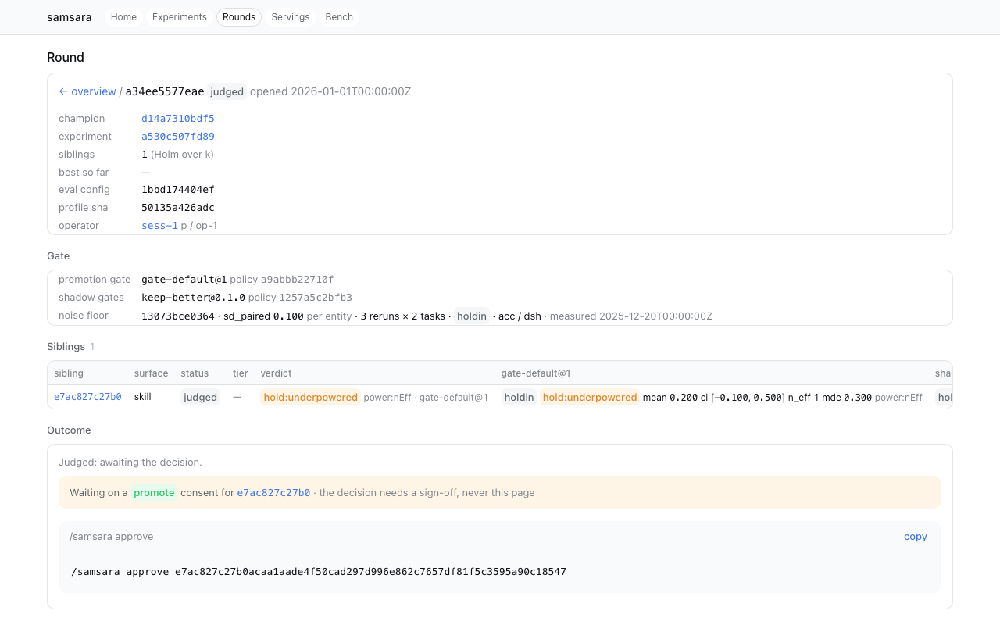
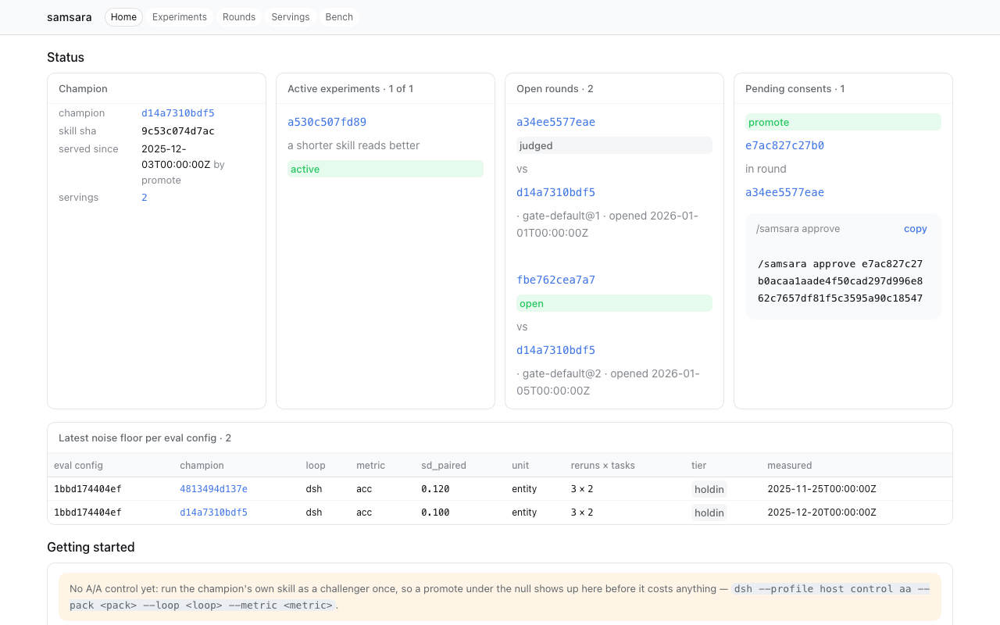
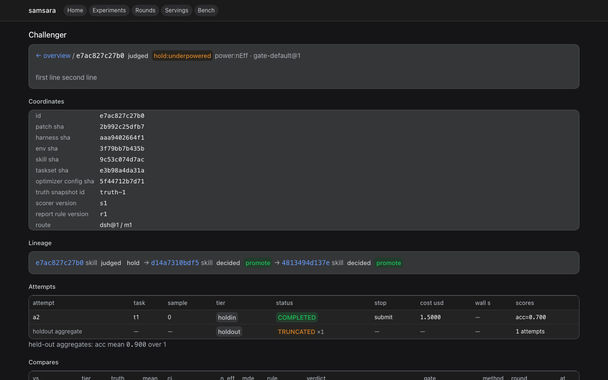

# @oldbulb/samsara-ui

The read-only `/samsara` pages — overview, experiments, rounds, challengers,
servings, bench, notebook — each with a JSON twin, plus the live event stream
of a round, as a host plugin on `ctx.webServer` (dsh's
`@deepseek-ai/dsh-host-webserver`). Binding design:
`docs/design/ui-and-certification.md`.

<p align="center"></p>

## Plugin

```
name:    samsara-ui
inject:  [webServer, ledger, champion, signoff]     # lifecycle is optional, see below
config:  { basePath: '/samsara', refreshMs: 5000 }   # both optional
```

| service | use |
|---|---|
| `webServer` | one `prefix` route under `basePath`, registered through `ctx.effect`, so disabling or reloading the row removes it |
| `ledger` | every read is `ctx.ledger.read(view, 'operator')` (`VIEWER`): the route has no auth and a proposer on the same host can reach loopback, so held-out attempts and scores arrive as per-challenger aggregates and no compare row carries its per-task deltas (S7); the page has no way to ask for another viewer |
| `champion` | the served state and its replay check |
| `signoff` | the pending sign-offs and the socket path — never the key |
| `lifecycle` (optional) | looked up per request with `ctx.get('lifecycle')`, so the row may mount after this one: status, `nextActions` with costs, pending consents, and the `lifecycle/event` stream behind SSE. Without it the pages still render; the round page just has no next actions and the stream carries only heartbeats |

Config comes only from the row: the plugin never parses the command line (a
co-resident `web-startup` row would reject unknown flags and exit the
process). Sign-off never goes through HTTP (E2): the pages show the
`/samsara approve <id>` or `samsara-signoff confirm …` command to copy, with
the socket path filled in and `--key` / `--who` left as placeholders. No
credential and no private-key path is ever read or rendered.

## Routes

Every page is `text/html` at its path and `application/json` at the same
path with `.json` appended. The JSON twin carries every number on the page
and ends in `sources: [...]`, the ids of the ledger rows the numbers came
from; the tests assert that no numeric cell on a page is missing from its
twin.

| route | page | `.json` twin |
|---|---|---|
| `<base>/`, `<base>/index` | overview: status strip (champion, active experiments, open rounds, pending consents, latest noise floor per eval config; onboarding hints when empty), champion, last settlement, challengers by tier, pending sign-offs; `?challenger=<id>` renders the evidence page above them | `<base>/index.json` |
| `<base>/experiments` | every experiment: hypothesis, prediction, gate, rounds, promotions, spent / budget, status | `<base>/experiments.json` |
| `<base>/experiments/<id>` | one experiment: header, budget bars, rounds table (verdict per gate — promotion gate plus one column per shadow gate — n_eff, mde, replicates, status; no per-round cost, the ledger records none), the lineage curve, predicted vs observed, pending consents | `<base>/experiments/<id>.json` |
| `<base>/rounds/<id>` | one round: gate pinned (`name@version`, policy sha), shadow gates, the noise floor used, siblings with their compares side by side, outcome, next actions per sibling with costs, live progress while open | `<base>/rounds/<id>.json` |
| `<base>/rounds/<id>/events` | `text/event-stream`: every lifecycle event that names the round (`challenger/transition`, `attempt/progress`, `round/closed`, `round/decided`, `campaign` …) with a judged compare's `per_task` stripped before it goes on the wire, a heartbeat comment every `refreshMs`, closed when the client goes away | — |
| `<base>/challengers/<id>` | the evidence page: coordinates, prediction, lineage, attempts, per-tier compares with shadow badge and gate, consents, links to round and experiment | `<base>/challengers/<id>.json` |
| `<base>/servings` | the champion history: from / to, by, consent, profile sha | `<base>/servings.json` |
| `<base>/bench` | the `gate bench --out` results under `data/bench/`; `?gates=a,b` keeps those gates, `?resamples=n` those resample counts | `<base>/bench.json` |
| `<base>/notebook/<session>` | one session's mirrored operator events, each linking to the round or experiment it touched | `<base>/notebook/<session>.json` |
| `<base>/api/summary` | legacy: `{champion, lastSettlement, tiers:{smoke,holdin,holdout,live}, pendingSignoffs}` | — |
| `<base>/api/challenger/:id` | legacy: `{row, lineage, attempts, scores, compares, consents, prediction_vs_observed}` | — |
| `<base>/api/certify/:skillSha` | legacy: `{skill_sha, rows:[{loop, adapter_version, facts_sha, tasks, valid_rate, utilization, cost_mean, verdict, gate_method, shadow, revoked, challengers}]}` | — |
| anything else under the prefix | `404` (an HTML page for an unknown row id, JSON otherwise) | |
| non-GET | `405` JSON | |

Every page module (`src/pages/*.ts`) exports `load(deps, params)`,
`render(model)` and `json(model)`; the router in `src/index.ts` maps a route
to a module. A page never computes a statistic: it formats what the ledger
recorded and what the lifecycle helpers answer.

<p align="center"></p>

## Design language

The pages are inline HTML with one `<style>` each, assembled from
`src/theme.ts`: no external asset, no React, no client bundle. The style is
dsh's own, inlined because dsh compiles its theme sheets into JS and exposes
no linkable CSS:

- **Tokens.** dsh's `--dsw-*` alias tokens (backgrounds, borders, labels,
  state colours, code, shadows, the font stacks), copied from
  `@deepseek-ai/dsh-client-ui-theme` at the pinned commit. The light values
  are declared on `body`, the dark values on `body[data-ds-dark-theme]` —
  dsh's contract, a boolean attribute on `<body>`, not a `:root` class.
- **Bootstrap.** dsh's `boot-theme` script, copied, sits right after
  `<body>`: it resolves `system` through `prefers-color-scheme` before the
  first paint, sets `documentElement.style.colorScheme` and toggles the
  attribute.
- **Recipes.** Card, table (12px, `th` on the sidebar fill, hover on
  `interactive-bg-hover`), badge (`ok` / `warn` / `danger` / `neutral`,
  `outline`, `shadow`), pill, `<dl>` stat block, code block with a copy
  button, callout, bar, focus ring; 14px prose, weight 500 for emphasis, the
  text wordmark `samsara` (dsh's whale is gated to official builds).
- **Charts.** Inline SVG in `currentColor` from `src/charts.ts`
  (`lineageSvg`): one dot per sibling judged on holdin (its delta against
  the round's champion — the ledger carries deltas, not levels, so the
  curve stays on one tier), the champion as the flat baseline at 0 with a
  tick per promotion, CI whiskers, one shadow-verdict square per (sibling,
  gate), gate-change lines, the predicted band.
- **Verdict badges.** `promote` ok, `hold` neutral, `hold:underpowered`
  warn, `hold:superseded` neutral with a `superseded` suffix, `drop` danger,
  `invalid` danger outline; a shadow verdict always carries a `shadow` pill
  and its gate name.

Tables scroll inside their own `overflow-x` container, so a page never
scrolls horizontally.

<p align="center"></p>

## Composition

Add the webserver row and this row to a bundle patch (never mount
`@deepseek-ai/dsh-web-app` for this; see `docs/dsh-plugin-notes.md` B4):

```yaml
- insert:
    - id: samsara-webserver
      name: '@deepseek-ai/dsh-host-webserver'
      config: { host: 127.0.0.1, port: 3099 }
    - id: samsara-ui
      name: '@oldbulb/samsara-ui'
      inject: [webServer, ledger, champion, signoff]
      config: { basePath: /samsara, refreshMs: 5000 }
```

Then `dsh --profile host serve` and open `http://127.0.0.1:3099/samsara`.
With the `lifecycle` row mounted as well, the round page gains next actions
and its live stream.

## Build and test

```
pnpm --filter @oldbulb/samsara-ui build
pnpm --filter @oldbulb/samsara-ui test      # vitest, offline
node packages/ui/tools/render-fixtures.mjs [out-dir]   # the fixture pages as HTML, light and dark
```

`tests/fixtures.ts` is a fake ledger / champion / signoff / lifecycle holding
one synthetic campaign (three rounds: a promotion, a hold with a shadow
verdict waiting on a sign-off, an open round under a changed gate);
`tests/pages-*.test.ts` render every route over it and check the badges, the
curve marks and the number traceability; `tests/api.test.ts` unit-tests the
builders and the handler; `tests/route.test.ts` boots the real webserver on
port 0 through the Loader with the plugin and fake service rows.
`tools/render-fixtures.mjs` writes the same fixture pages to files (the dark
variant with `data-ds-dark-theme` set) — the screenshots in `docs/img/` are
those files at 1280×800.

<p align="center"></p>

## Notes

- `proposer` in the summary is the row's `optimizer_config_sha` (short): the
  challenger row carries no proposer name@version.
- `cost_ratio` is derived from attempts: mean `cost.usd` of the challenger
  over the mean of the compared row at the compare's tier; `null` when either
  side has no usd cost.
- `utilization` in the certification table is the mean of
  `attempts.skill_utilization.value` over the attempts whose loop reported a
  number (the runner writes `{ value }` from the loop's `finished` event);
  when every attempt reported `inline` or nothing, the string `inline`.
- The bench page reads files, not the ledger: `gate bench` results are
  written by the runner, and the page only formats them.
